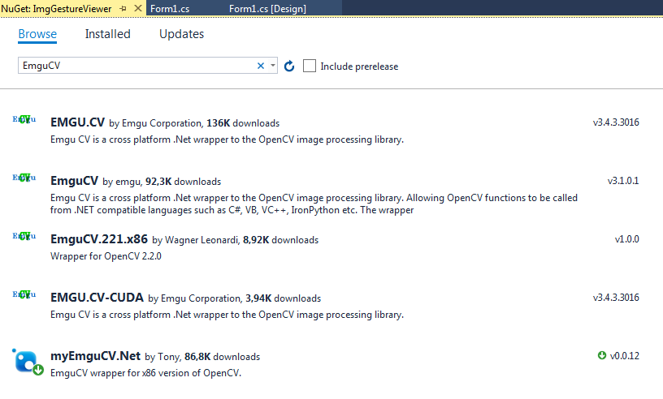

# ImgGestureViewer

## General info
ImgGestureViewer is an application designed to view photos without using peripherals such as a mouse or keyboard. The program for changing photos uses the user's gestures read from the camera.

## Screenshots

# About Emgu CV
Emgu CV is a cross platform .Net wrapper to the OpenCV image processing library. Allowing OpenCV functions to be called from .NET compatible languages such as C#, VB, VC++, IronPython etc. The wrapper can be compiled in Mono and run on Windows, Linux, Mac OS X, iPhone, iPad and Android devices.
More info about EmguCV: http://www.emgu.com
## Technologies
* .NET 
* C#
* EmguCV
* Microsoft Visual Studio 2017

## Setup
### NuGet
Using nuget package manager is probably the easiest way to include Emgu CV library in your project. 
* From your project, right click on "References" and select "Manager Nuget Packages..." option. It will open up nuget package manager. In package source, make sure that "nuget.org" is selected. (If you are using the commercial release, please check the instruction in the commercial download area for instructions to setup the commercial release nuget repository.)
* Under "Browse", enter the search text "emgu cv" and you should be able to find the Emgu.CV nuget pacakge. 

## Usage

* Connect your webcam
* Run ImgGestureViewer.exe
* Load images
* Turn on the camera
* Follow the gesture

## Default gestures
* Next photo - show one finger

* Previous photo - show two fingers

 
## Contact
Created by [Damian Suchy](https://github.com/4lkon) 
Mail: damian.suchy@microsoft.wsei.edu.pl